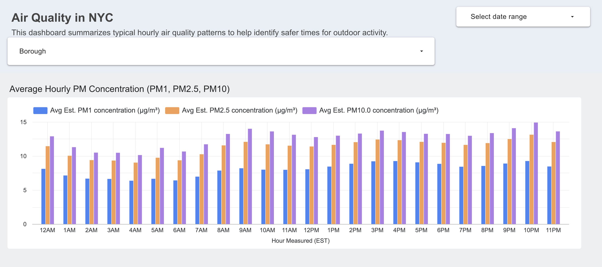
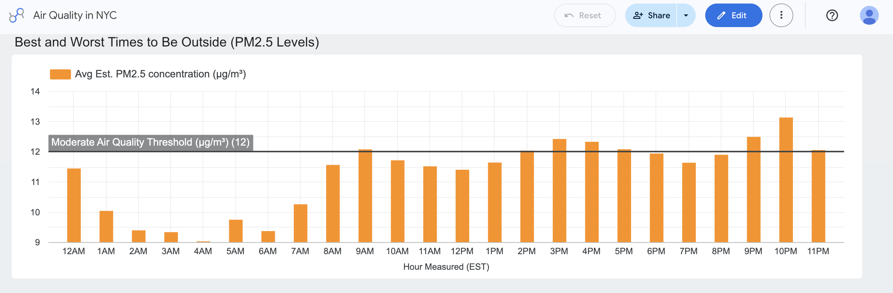
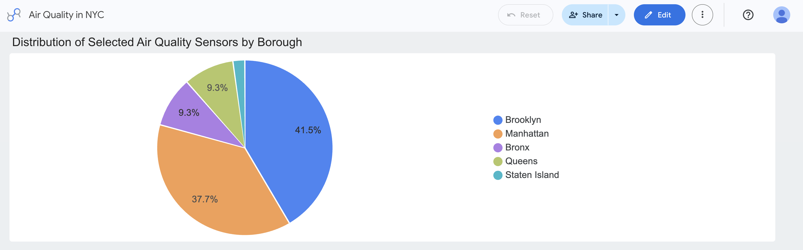
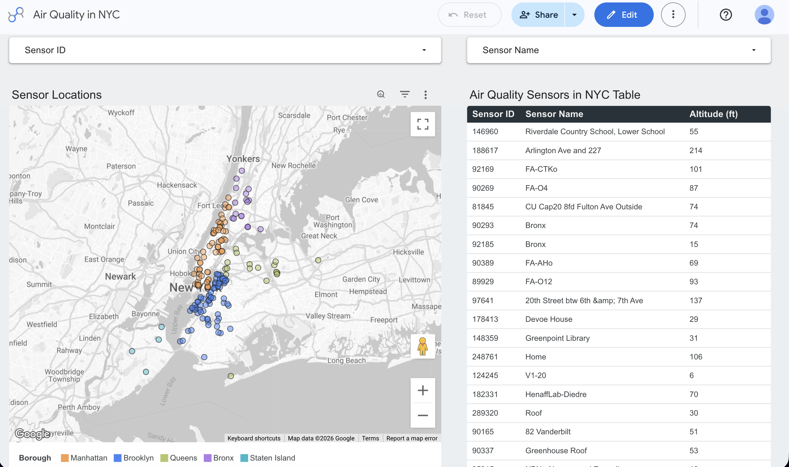

# Air Quality Analytics Dashboard

## Problem Statement

Many people have pre-existing lung conditions (e.g., asthma, COPD) that can be exacerbated by poor air quality.  
New York City is densely populated, so being able to quickly understand “when is it best to be outside?” can help residents plan their day.

This project’s goal is to provide a dashboard that summarizes *typical* air quality patterns and answers:
- What time(s) of day tend to have the best air quality?
- How does that vary by NYC borough?

Here is the [Air Quality in NYC dashboard](https://datastudio.google.com/reporting/83b8ded9-d636-4757-9621-51fc4c99688f/page/KgtuF) created to solve this problem.

**Assumptions / limitations**
- The dashboard focuses on averages / typical patterns, not real-time alerts.
- Unusual events (e.g., wildfire smoke episodes) can distort averages; the dashboard is intended to reflect “normal” conditions as much as the data allows.

---

## Solution Overview

This project implements an end-to-end data pipeline and dashboard for NYC air quality analytics, using modern cloud and data engineering tools.

### Pipeline Steps
1. **Data Ingestion:**  
	- Batch pipeline extracts raw sensor data and loads it into a cloud data lake via python flow in Kestra.
2. **Data Lake to Warehouse:**  
	- Data is loaded from the lake into BigQuery (cloud data warehouse).
3. **Transformations:**  
	- dbt is used to clean, join, and aggregate the data, producing marts for dashboard consumption. Kestra runs dbt right after pulling the data from the PurpleAir API.
4. **Dashboard:**  
	- An interactive dashboard is built in Looker Studio (now called Data Studio), directly connected to BigQuery, to visualize air quality patterns by time and borough.

---

## Technologies Used

- **Cloud:** Google Cloud Platform (GCP)
- **Infrastructure as Code:** Terraform (for provisioning GCP resources)
- **Workflow Orchestration:** Kestra
- **Data Warehouse:** BigQuery
- **Transformations:** dbt
- **Dashboard:** Looker Studio (recently changed back to Google Data Studio)

---


## Data Warehouse Optimization

Partitioning and clustering choices for each major table:

- **stg_purpleair_sensors**
  - Partitioned by: `pulled_at_ts` (timestamp)
  - Clustered by: `sensor_index`, `location_type`
  - Rationale: Partitioning by timestamp for efficient time filtering; clustering by sensor for deduplication and sensor-level lookups. `location_type` is included for completeness. Although it has low cardinality, the queried dataset creates two almost equally sized clusters. In order to future proof the data, assuming more people get sensors from Purple Air, the table is also clustered by `location_type`.

- **mart_avg_hourly_per_borough**
  - Partitioned by: `pulled_date` (date)
  - Clustered by: `boro_name`
  - Rationale: Partitioning by date for time-series analysis in dashboard tile showing all PM types (1.0, 2.5, and 10.0); clustering by borough (commonly used filter column in the dashboard) for dashboard queries and grouping.

- **mart_best_time_to_be_out**
  - Partitioned by: `pulled_date` (date)
  - Clustered by: `boro_name`
  - Rationale: Partitioning by date for time-based queries and analysis in dashboard tile showing best time to be out based on the Moderate Air Quality Threshold; clustering by borough for dashboard use (commonly used filter column in the dashboard).

- **mart_sensors_nyc**
  - Not partitioned
  - Clustered by: `boro_name`, `sensor_index`, `sensor_name`
  - Rationale: This is a dimension-like table with one row per sensor (latest state); clustering by borough, then sensor index and name for efficient map and table usage in the dashboard. The tiles that use this mart as a source primarily advertise filtering via `sensor_index` and `sensor_name`, however, with some testing from a few colleagues, more people opted to filter by borough to see specific sensor locations for the borough they were interested in, which is why `boro_name` is clustered firstly, then `sensor_index` and `sensor_name`.

- **dim_nyc_boroughs**
  - Not partitioned
  - Not clustered
  - Rationale: Tiny static dimension; no partitioning or clustering needed.
  *NOTE*: This table is added via a one time run in Kestra from the `nyc-borough-boundaries-raw-load.yml` flow in the `flows` folder of this repository. 

---

## dbt Transformations

- **Staging:**  
	- `stg_purpleair_sensors` standardizes the raw PurpleAir sensor extract by casting fields into the correct data types, converting Unix timestamps into usable timestamp columns, and normalizing `location_type` into readable indoor or outdoor labels. This creates a clean base table for downstream transformations.

- **Intermediate:**  
	- `int_purpleair_sensors_ts_mapped_deduped` filters the staged dataset to outdoor sensors with higher confidence readings, truncates observations to the hour, and removes duplicate sensor records by keeping the latest observation for each sensor and reporting timestamp combination.
	- `int_sensors_hourly_with_borough` enriches those cleaned hourly sensor readings by joining them to NYC borough boundaries using geospatial logic, so each observation can be analyzed geographically in downstream marts.

- **Mart Models:**  
	- `mart_avg_hourly_per_borough` aggregates PM1.0, PM2.5, and PM10.0 readings to the borough-hour grain. This mart powers the dashboard tile that shows how average pollution levels change throughout the day for each borough.
	- `mart_best_time_to_be_out` focuses on PM2.5 at the borough-hour grain and is used for the dashboard tile that highlights cleaner versus less favorable times to be outside relative to a moderate air quality threshold.
	- `mart_sensors_nyc` stores one latest-known row per sensor, including borough, sensor metadata, and geographic point location. This mart powers the sensor distribution chart, the map visualization, and the detailed sensor lookup table in the dashboard.

---


## Dashboard

The dashboard is built in **Looker Studio** (Google Data Studio) and is directly connected to the BigQuery warehouse. It provides:
- **Tile 1:** Average hourly PM 1.0, 2.5, and 10.0 concentrations (time series bar chart).
- **Tile 2:** Best and Worst Times to Be Outside (PM2.5 Levels - most critical air pollutant for lung health according to USEPA) with threshold of 'moderate air quality' (helpful to see when air quality is at a good level).
- **Tile 3:** Distribution of selected air quality sensors by borough (categorical pie chart) - (without filters, shows distribution of all air quality sensors by borough since all sensors are selected).
- **Map/Table:** Interactive map and table of sensor IDs, names, and altitudes at which they are placed.

Users can filter by borough, date range, and sensor.

### Dashboard Preview

The screenshots below show static previews of the live dashboard views available in Looker Studio (recently named back to Data Studio).

**Tile 1: Average hourly PM concentrations by borough**



**Tile 2: Best and worst times to be outside**



**Tile 3: Sensor distribution by borough**



**Map and table: Sensor locations and details**



**How to access:**
Please go to the link here for the dashboard: [Air Quality in NYC](https://datastudio.google.com/u/0/reporting/83b8ded9-d636-4757-9621-51fc4c99688f/page/KgtuF)

---

## Reproducibility

### Prerequisites

The instructions after this section assume you have the following tools installed/accounts set up.

- UV (Python package and manager)
- dbt (this should be installed with the BigQuery adapter `dbt-bigquery` as the project uses BigQuery)
- GCP account & Project (named however you'd like it to be named)
- Terraform (to provision infra)

### Setup Instructions

1. **Clone the repository:**
    - Clone the repository and open your terminal and IDE to the folder it is in.

	```
	cd Air-Quality-Analytics-Dashboard
	```

2. **Set up GCP credentials:**
    - Make a Terraform Service Account in your GCP.
        - Go to IAM & Admin > Service Accounts > Create Service Account
        - Give the service account the following roles (you can add more roles to the account if you accidentally continue without adding all of the following):
            1. BigQuery Admin
            2. Compute Admin
            3. Project IAM Admin
            4. Service Account Admin
            5. Service Account User
            6. Storage Admin
        - Create the account
        - Go to `Service Accounts` on the left hand side of the screen, and click the service account you just created.
        - Go to `Keys`
        - Add Key > Create new key > JSON
        - Once JSON key is installed, you may proceed to the next step.
	- Place your service account key in `iac/keys/my-creds.json`
	- Set the `GOOGLE_APPLICATION_CREDENTIALS` environment variable to the JSON key you placed in the previous step.

3. **Provision infrastructure:**

    - Please look within the `variables.tf` file and edit the variables to match YOUR project (especially project_id - otherwise `terraform apply` will fail as the default variable there is my own currently used project id). Additionally, within the `docker-compose.yml`, you may change the default Kestra login to whatever you desire, along with the postgres db and pgadmin services.

    *NOTE*: Please be aware that running the docker-compose locally will not fully function as the Kestra instance will run assuming there is a tied up service account that Kestra may use to access your Google Cloud project. 

	```
	cd iac
	terraform init
	terraform apply
	```

4. **Preparing Kestra and flows:**
    - Wait a few minutes for the Google Cloud VM to spin up Kestra and its other dependencies. Then, once Kestra is spun up, do the following:
        1. Open the External IP of your VM at port 8080 to get to the Kestra login page and log in with the credentials you saved within `docker-compose.yml`.
        2. If you're logged in, you're good to go! Next you're going to go to the [PurpleAir developer portal](https://develop.purpleair.com/), make an account, then make a project and finally make a Read key. Copy said key, then go to the KV Store and make a key named `PURPLE_AIR_API_KEY`, placing your new API key into it. Starting out you have a free 1,000,000 points in your account - that should be enough to pull data from PurpleAir for approximately 2 weeks.
        *NOTE*: Since the IaC creates the `kestra-svc-acc` Google service account, you will not need to create a `GOOGLE_APPLICATION_CREDENTIALS` KV pair since Kestra will use the SVC Account to run dbt.
        3. Make the following additional KV keys in Kestra within the namespace `dashboard_raw_data`:
            - `DBT_GIT_REPO`
                - Push your cloned repository to your github account and put the link to the repo here. For example, my value is `https://github.com/CS9490/Air-Quality-Analytics-Dashboard.git`. This will allow Kestra to run the dbt project within the dbt folder of your repository.
            - `GCP_BUCKET_NAME`
                - the full name of the GCP Bucket for your project.
            - `GCP_LOCATION`
                - the zone your GCP VM is located in.
            - `GCP_PROJECT_ID`
                - your full GCP project ID
            - `GITHUB_TOKEN`
                - Assuming your repository is private still, you will need to make a Github access token for your account in order for Kestra to clone in the `dbt` folder contents from the repository and run it after pulling the data from PurpleAir.
        4. Great, you're almost done now. Go to the `flows` folder of this repository and copy each flow into Kestra.
        5. Manually run the `nyc-borough-boundaries-raw-load` flow in order to get the borough boundaries data within your Google Cloud project.
        6. To test it out, run the `purple-air-sensors-raw-data-extract` flow manually once and ensure it runs. It will run every hour on the hour (see the Cron schedule within the flow). With this ran, you should have some data to play with around with in Google Cloud.
            - *NOTE*: The `dbt-run` flow is only kept to manually run the dbt project from within Kestra. Use it if you made any changes and want to test them before the next `purple-air-sensors-raw-data-extract` run occurs.
        7. Kestra is now set up. You can let it run the `purple-air-sensors-raw-data-extract` flow and monitor it.

5. **Access the dashboard:**
    - Once you have a days worth of data in your GCP Bucket and Big Query, you can make the dashboard yourself if you choose to. You have the choice of either copying the one I created or attempting to make it yourself! It is much easier if you make a copy and simply replace the data sources yourself.

---

## Notes for Reviewers

- All code and configs are included in this repo.
- No hardcoded local paths; all credentials and project IDs are parameterized.
- dbt models are partitioned and clustered to match dashboard query patterns.
- Please see the dashboard for interactive exploration and insights.